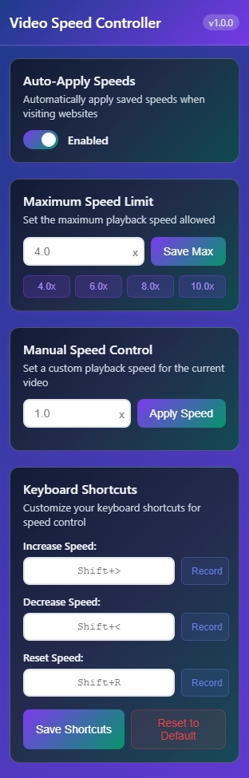
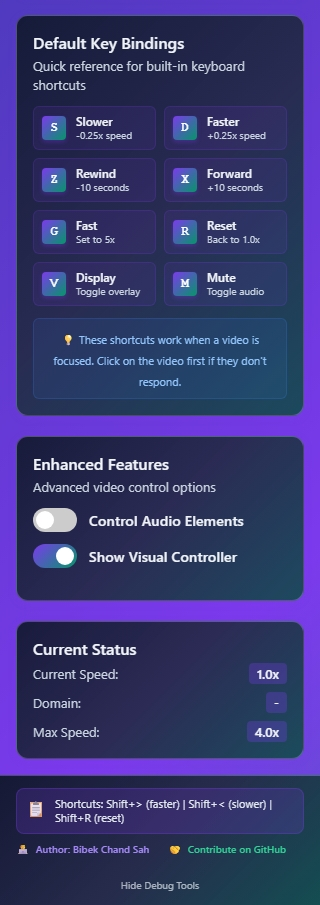

# Video Speed Controller - Enhanced Browser Extension

A powerful and feature-rich browser extension that gives you complete control over video playback speed on any website. Works seamlessly with YouTube, Netflix, Coursera, Udemy, and thousands of other video platforms.

## 📸 Preview

<table>
  <tr>
    <td width="50%">
      <h3 align="center">Extension Popup Interface</h3>
      <p align="center">
        
      </p>
    </td>
    <td width="50%">
      <p align="center">
        
      </p>
    </td>
  </tr>
</table>

## 🚀 Features

### Core Functionality
- **Universal Compatibility**: Works on virtually any website with HTML5 video or audio
- **Precise Speed Control**: Adjust playback speed from 0.07x to 10x with fine-grained control
- **Persistent Settings**: Remembers your preferred speed for each website
- **Visual Feedback**: Beautiful speed indicator with smooth animations
- **Keyboard Shortcuts**: Customizable hotkeys for quick speed adjustments

### Enhanced Controls
- **Visual Controller**: Draggable on-screen controller with intuitive buttons
- **Audio Support**: Control audio playback speed in addition to videos
- **Advanced Shortcuts**: 9 different keyboard shortcuts for comprehensive control
- **Educational Platform Integration**: Optimized presets for learning platforms
- **Cross-Frame Support**: Works with embedded videos and iframes

### Educational Platform Optimization
- **Coursera**: Optimized speeds and lecture navigation
- **Udemy**: Chapter skipping and progress tracking
- **Khan Academy**: Practice mode and concept review
- **Apna College**: Coding-focused speed presets
- **YouTube Education**: Playlist and chapter navigation

## 📦 Installation

### From Chrome Web Store
1. Visit the [Chrome Web Store](https://chrome.google.com/webstore) (link coming soon)
2. Click "Add to Chrome"
3. Confirm installation

### Manual Installation (Developer Mode)
1. Download or clone this repository
2. Open Chrome and navigate to `chrome://extensions/`
3. Enable "Developer mode" in the top right
4. Click "Load unpacked" and select the extension folder
5. The extension will appear in your browser toolbar

## 🎮 Usage

### Basic Controls
- **Increase Speed**: `Shift + >` (default)
- **Decrease Speed**: `Shift + <` (default)
- **Reset Speed**: `Shift + R` (default)

### Enhanced Keyboard Shortcuts
- **S**: Slower (decrease by 0.25x)
- **D**: Faster (increase by 0.25x)
- **Z**: Rewind 10 seconds
- **X**: Forward 10 seconds
- **G**: Quick speed (1.8x default)
- **R**: Reset to 1.0x
- **V**: Toggle visual controller
- **M**: Mute/unmute
- **Space**: Pause/play (optional)

### Visual Controller
- Drag the controller to reposition it on any video
- Click speed buttons for instant adjustments
- Hover for additional controls and information

### Popup Interface
Click the extension icon to access:
- Speed presets (0.5x to 10x)
- Custom speed input
- Maximum speed settings
- Keyboard shortcut customization
- Educational platform features
- Audio control toggle

## ⚙️ Configuration

### Speed Settings
- **Custom Speed**: Enter any speed between 0.25x and your maximum
- **Speed Presets**: Quick access to common speeds
- **Maximum Speed**: Set your preferred speed limit (2x to 10x)
- **Persistence**: Auto-apply saved speeds when visiting sites

### Keyboard Shortcuts
- **Customizable Bindings**: Record your own key combinations
- **Force Override**: Override website shortcuts when needed
- **Multiple Actions**: Support for 9 different shortcut actions

### Enhanced Features
- **Audio Control**: Enable speed control for audio elements
- **Visual Controller**: Show/hide the draggable controller
- **Educational Mode**: Automatic optimization for learning platforms
- **Cross-Frame Support**: Control videos in embedded frames

## 🎓 Educational Platform Features

### Coursera Integration
- Optimized speeds: 1.25x, 1.5x, 1.75x, 2.0x
- Auto-skip intro sequences
- Chapter navigation support
- Note timestamps

### Udemy Enhancement
- Recommended speeds up to 3.0x
- Lecture progress tracking
- Auto-advance features
- Chapter skipping

### Khan Academy Optimization
- Practice mode support
- Concept review integration
- Progress tracking
- Slower default speeds for better comprehension

## 🔧 Technical Details

### Compatibility
- **Browsers**: Chrome, Edge, and other Chromium-based browsers
- **Websites**: Works on 99%+ of video websites
- **Video Types**: HTML5 video, audio elements, embedded players
- **Frameworks**: React, Angular, Vue.js compatible

### Performance
- **Lightweight**: Minimal memory footprint
- **Efficient**: Uses RequestIdleCallback for optimal performance
- **Non-Intrusive**: Doesn't interfere with website functionality
- **Shadow DOM**: Isolated styling prevents conflicts

### Privacy
- **Local Storage**: All settings stored locally
- **No Tracking**: Zero data collection
- **No Network Requests**: Works completely offline
- **Open Source**: Full transparency

## 🛠️ Development

### Project Structure
```
video-speed-controller/
├── manifest.json          # Extension manifest
├── content.js            # Main content script
├── popup.html           # Extension popup interface
├── popup.js             # Popup functionality
├── popup.css            # Popup styling
├── inject.css           # Injected styles
├── background.js        # Background script
└── icons/              # Extension icons
```

### Key Components
- **VideoSpeedController**: Main controller class
- **EnhancedVideoController**: Individual video management
- **PopupController**: Extension popup interface
- **Educational Platform Detection**: Smart platform recognition

### Building from Source
1. Clone the repository
2. Make your changes
3. Test in developer mode
4. Package for distribution

## 🤝 Contributing

We welcome contributions! Here's how you can help:

### Bug Reports
- Use the GitHub Issues tab
- Include browser version and website URL
- Provide steps to reproduce

### Feature Requests
- Check existing issues first
- Describe the use case clearly
- Consider implementation complexity

### Code Contributions
1. Fork the repository
2. Create a feature branch
3. Make your changes
4. Test thoroughly
5. Submit a pull request

### Development Guidelines
- Follow existing code style
- Add comments for complex logic
- Test on multiple websites
- Ensure backward compatibility

## 📋 Roadmap

### Upcoming Features
- Firefox extension port
- Safari extension development
- Mobile browser support
- Cloud settings sync
- AI-powered speed optimization

### Long-term Goals
- Voice control integration
- Gesture-based controls
- Advanced analytics
- Enterprise features
- API for third-party integration

## 🐛 Troubleshooting

### Common Issues

**Extension not working on a website**
- Refresh the page after installation
- Check if the site blocks extensions
- Try disabling other extensions

**Keyboard shortcuts not responding**
- Check if website overrides shortcuts
- Enable "Force key binding" in settings
- Try different key combinations

**Speed not persisting**
- Enable "Auto-apply speeds" in popup
- Check browser storage permissions
- Clear extension data and reconfigure

**Visual controller not appearing**
- Toggle controller visibility in popup
- Check if site has conflicting styles
- Try refreshing the page

### Debug Mode
Enable debug mode in the popup for detailed information:
- Video detection status
- Controller count
- Platform recognition
- Error messages

## 📄 License

This project is licensed under the MIT License - see the [LICENSE](LICENSE) file for details.

## 👨‍💻 Author

**Bibek Chand Shah**
- Website: [bibekchandsah.com.np](https://www.bibekchandsah.com.np/)
- GitHub: [@bibekchandsah](https://github.com/bibekchandsah)

## 🌟 Acknowledgments

- Thanks to all contributors and testers
- Inspired by the need for better video learning tools
- Built with modern web technologies
- Community feedback and suggestions

## 📞 Support

- **GitHub Issues**: For bug reports and feature requests
- **Email**: Contact through website
- **Documentation**: Check the wiki for detailed guides

---

**Made with ❤️ for better video learning experiences**

*If this extension helps you learn faster or enjoy videos more, consider giving it a star ⭐ on GitHub!*